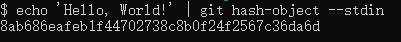

### 分布式管理系统

#### Git存储数据的方式
- 核心是键值对
- 值是数据,键是数据的哈希值

##### 键-SHA1
- 是一种加密哈希函数
- 通过提交的部分数据,它会产生一组40位的16进制数组
- 当数据相同时,返回的值一定相同

##### 值-blob
- git 会将压缩数据连同一些元数据一同存放在blob对象中
    - 头部是blob标识符和正文的大小
    - content和header以\0分隔(C语音中的空字符串结束符)
    - 正文  
  

#### git内部的操作
##### hash-object命令(获取content的SHA1字符串)
 
- --stdin => 从命令行中获取标准输入,否则该命令一般用于转换文件
- 