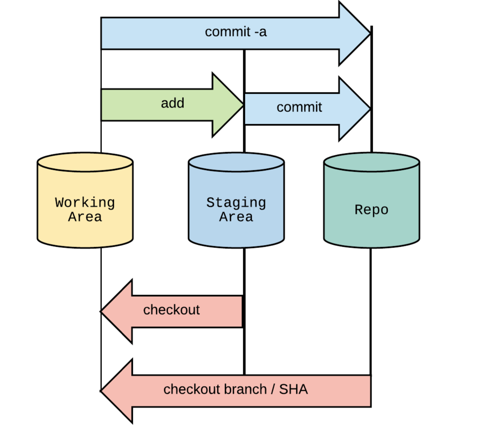

## 代码存在的三个区域
1. Working Area
2. Staging Area
3. Repository
### Working Area
- 该区域中的文件是未被 git 处理的文件
- 也被叫做 untracked files

#### ls-files -s 命令

- 展示暂存区中所有的文件
#### 暂存区中文件的添加与删除
```
//添加
git add <file>
//删除
git rm <file>
//重命名
git mv <file>
```
#### git add -p 命令
- 可交互的命令
- 一般用于做了大量修改时拆分提交操作

### Staging Area(暂存区)
- 即将成为下一次提交的文件
- 暂存区让 git 知道下一次提交与当前提交的变化
### Repository
- 保存所有提交的区域

### git中代码所在位置的切换


### git stash 
- 保存未提交的变动
