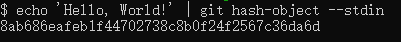

### 分布式管理系统

#### Git存储数据的方式
- 核心是键值对
- 值是数据,键是数据的哈希值

##### 键-SHA1
- 是一种加密哈希函数
- 通过提交的部分数据,它会产生一组40位的16进制数组
- 当数据相同时,返回的值一定相同

##### 值-blob
- git 会将压缩数据连同一些元数据一同存放在blob对象中
    - 头部是blob标识符和正文的大小
    - content和header以\0分隔(C语音中的空字符串结束符)
    - 正文  
  

#### git内部的操作
##### hash-object命令(获取content的SHA1字符串)
 
- --stdin => 从命令行中获取标准输入,否则该命令一般用于转换文件

##### openssl命令(直接从内容获取sha1值)

- -n=>去掉换行符

#### git存储数据的方式(.git文件夹)

- -w=>write 写下入

##### .git文件夹的结构
  
- 刚才的blob文件就保存在objects/8a文件夹下
- 该文件夹以blob sha1值前两个字符命名
- blob依然缺少了一些信息
    - 文件名
    - 文件夹结构

#### tree对象
- 包含指针(SHA1)
    - 指向blob
    - 指向其他tree
- 指针类型(blob/tree)
- 文件名
- 模式  
  

##### tree的一些优化
- 相同的内容只存储一次
- 所有的存储对象都是压缩文件
- As files change, their contents remain mostly similar.
- git会把问价压缩为一个包文件
- 包文件会存储对象以及增量-文件不同版本的差异
- 包文件会在以下条件下生成:
    - 内容较多
    - 垃圾回收期间
    - 推向远程仓库

#### commit对象
构成:
- 指针:指向tree
- 作者和committer
- 日期
- message
- 父级提交(可能没有,也可能多个)
- SHA1值是以上数据的hash值  
  

